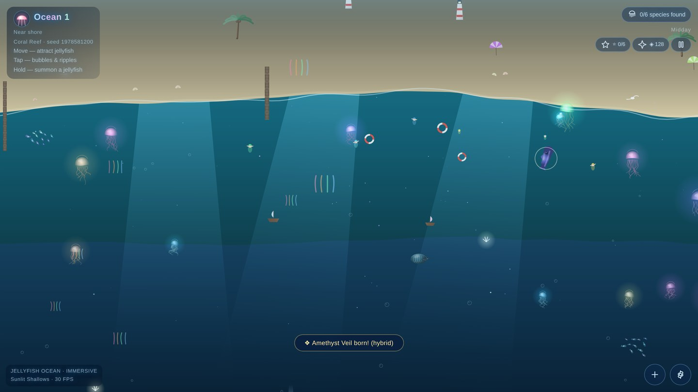
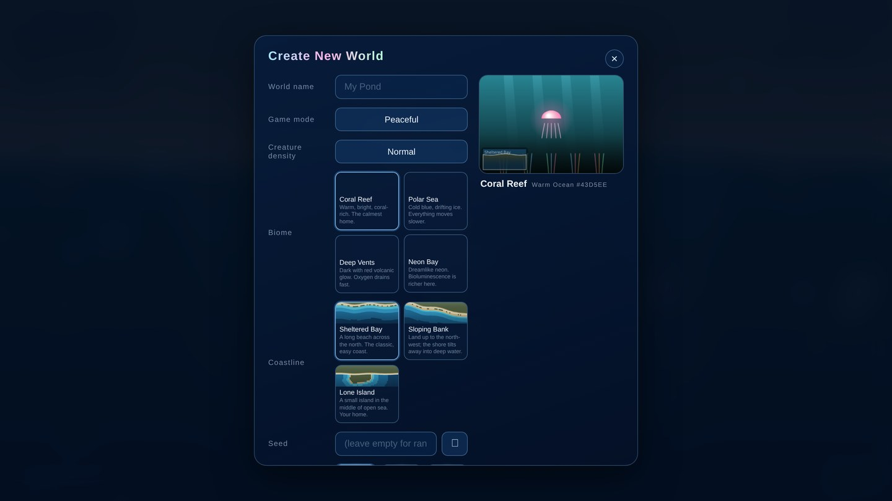
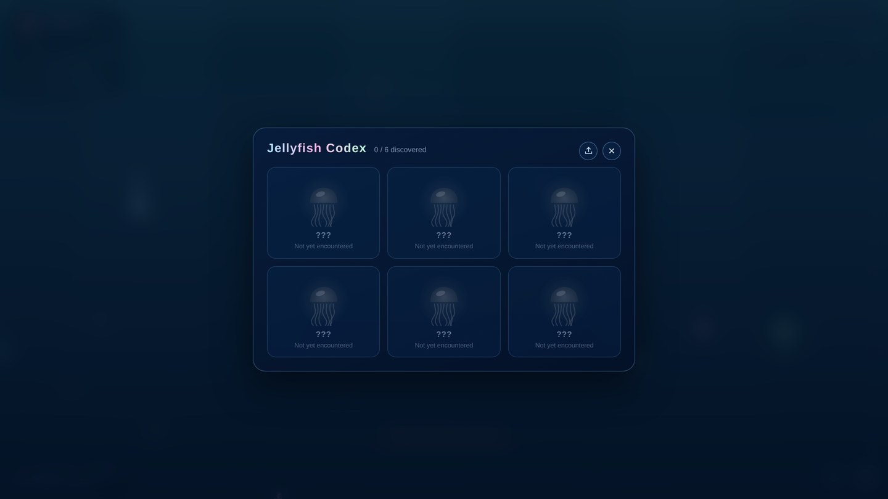
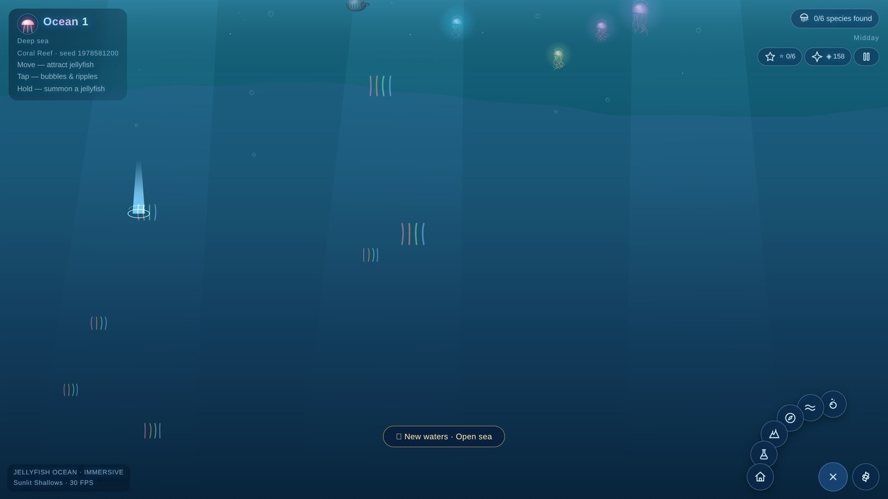
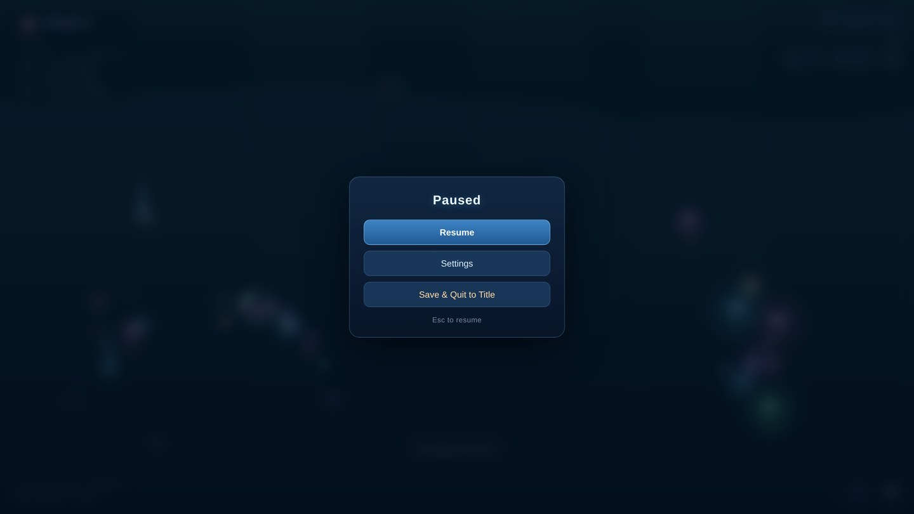
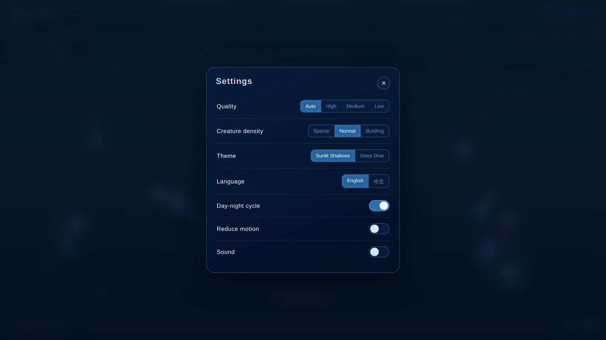
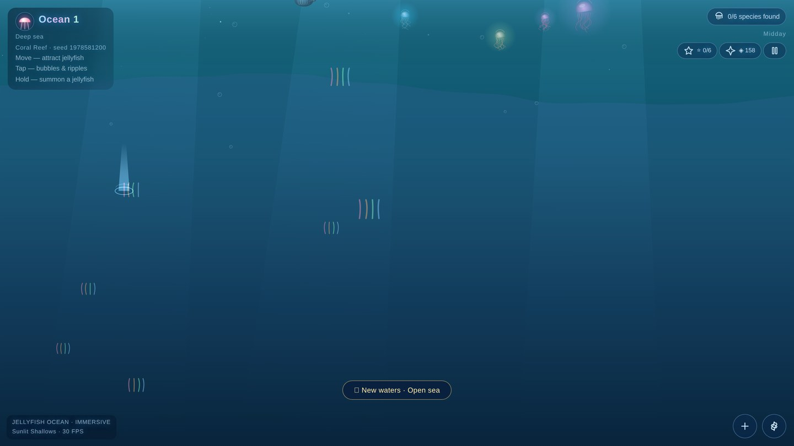
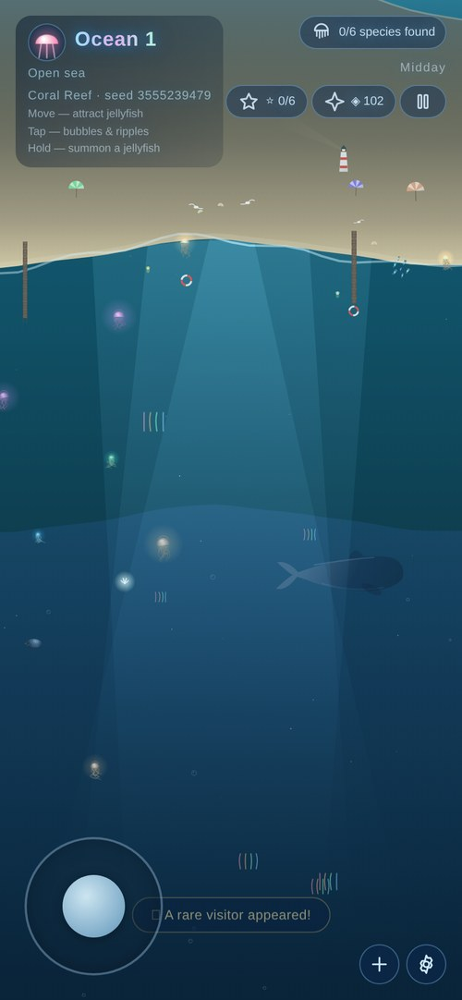

<div align="center">

# 🪼 Jellyfish Ocean

**🌊 一片可以触摸的深海 · ✨ 零依赖 · 📦 零构建 · 📱 移动优先**

<sub>An immersive, interactive jellyfish ocean — pure vanilla Canvas 2D, zero dependencies, zero build</sub>

<br />

### 👉 [**🌐 立即在线体验 · Live Demo**](https://elijah-lin-dancer.github.io/Jelly-Fish-childen-game/) 👈

[](https://elijah-lin-dancer.github.io/Jelly-Fish-childen-game/)
[](https://github.com/Elijah-Lin-Dancer/Jelly-Fish-childen-game/blob/main/LICENSE)
[](https://github.com/Elijah-Lin-Dancer/Jelly-Fish-childen-game)
[](https://github.com/Elijah-Lin-Dancer/Jelly-Fish-childen-game)
[](https://github.com/Elijah-Lin-Dancer/Jelly-Fish-childen-game)
[](https://github.com/Elijah-Lin-Dancer/Jelly-Fish-childen-game)
[](https://github.com/Elijah-Lin-Dancer/Jelly-Fish-childen-game)
[](https://github.com/Elijah-Lin-Dancer/Jelly-Fish-childen-game)

<br />

<a href="https://elijah-lin-dancer.github.io/Jelly-Fish-childen-game/">
  
</a>

<sub>👆 点击上图直接进入在线体验 · Click the image to open the live demo</sub>

<br />

> 🪼 **从沙滩走向深渊** —— 六种发光水母、结队鱼群、悠然海龟、远景鲸鱼、海岸生命，
> 全部用**纯 Canvas 2D 手写**，没有任何框架和依赖。
> 建一处世界，选一片群系，潜下去看看藏着什么。

</div>

---

## 📖 目录 · Table of Contents

- [✨ 项目简介](#-项目简介--about)
- [🎬 玩法一览](#-玩法一览--at-a-glance)
- [🎮 核心玩法](#-核心玩法--gameplay)
- [🌊 视觉特性](#-视觉特性--visuals)
- [🕹️ 操作说明](#️-操作说明--controls)
- [⚡ 快速开始](#-快速开始--quick-start)
- [🏗️ 技术亮点](#️-技术亮点--under-the-hood)
- [📁 项目结构](#-项目结构--structure)
- [🧪 回归测试](#-回归测试--tests)
- [📱 移动端适配](#-移动端适配--mobile)
- [🌐 浏览器支持](#-浏览器支持--browser-support)
- [🗺️ 开发历程](#️-开发历程--roadmap)
- [⭐ 支持项目](#-支持项目--show-your-support)
- [📄 许可证](#-许可证--license)

---

## ✨ 项目简介 · About

> 🪼 **Jellyfish Ocean** 是一片可以触摸的深海。从标题屏新建世界、选群系、输种子，
> 一路从沙滩走向深渊 —— 六种发光水母、鱼群、海龟、鲸鱼点缀其间。全部用**纯 Canvas 2D 手写**，
> 没有任何框架和依赖。

整个项目是 **约 16000 行（61 个 ES Module + CSS + HTML）** 的单页应用，不经过任何打包工具，
直接在浏览器里以原生 **ES Modules** 运行。给它一个静态服务器（或 GitHub Pages），它就能跑。

从「禅意沙盒」到「可长期游玩的游戏」，项目历经 **11 个阶段**的迭代——图鉴与存档、变异与成就、
截图分享、设置与引导、活的海（洋流 + 生态链）、繁育与基因、深潜与海域叙事、双模式与建造、
自适应音频、MC 式开篇（标题屏 + 5 群系 + 种子）、以及开放世界（含海岸带）。各阶段设计稿见
[`docs/archive/`](docs/archive/)。

<div align="right"><a href="#-目录--table-of-contents">⬆️ 回到顶部</a></div>

---

## 🎬 玩法一览 · At a Glance

<table>
<tr>
<td width="50%">

**🏝️ 开篇 · MC 式新建世界**
<br />

<sub>选群系（带实时缩略图）· 选海岸线 · 输种子 · 挑伴随水母</sub>

</td>
<td width="50%">

**📖 物种图鉴**
<br />

<sub>6 个物种，记录首次发现 / 已见次数 / 变异数</sub>

</td>
</tr>
<tr>
<td width="50%">

**🕹️ 右下 FAB · 玩法抽屉**
<br />

<sub>投喂 · 洋流 · 图鉴 · 建造 · 繁育实验室 · 引水母归巢</sub>

</td>
<td width="50%">

**⏸️ 暂停菜单**
<br />

<sub>继续 / 设置 / 保存并回到标题，世界真冻结</sub>

</td>
</tr>
<tr>
<td width="50%">

**⚙️ 设置面板**
<br />

<sub>画质档 · 生物密度 · 主题 · 语言 · 减弱动效 · 静音</sub>

</td>
<td width="50%">

**🌊 深海 · 氛围**
<br />

<sub>深度雾、虚焦水母、渐暗水色 —— 走向无光深渊</sub>

</td>
</tr>
</table>

<div align="center">

<br />
<sub>📱 移动端竖屏 —— 虚拟摇杆 + 触摸交互，桌面 / 手机同一个世界</sub>
</div>

<div align="right"><a href="#-目录--table-of-contents">⬆️ 回到顶部</a></div>

---

## 🎮 核心玩法 · Gameplay

**🏝️ 开篇与开放世界**

| 🎯 玩法 | 📝 说明 |
| :--- | :--- |
| 🏠 **标题屏 + 新建世界** | MC 式开篇：世界名、游戏模式、生物群系（含**实时缩略图**）、**海岸线类型**、种子码、伴随水母、起始礼包 |
| 🗺️ **5 个生物群系** | 珊瑚礁 / 极地冰海 / 深海热泉 / 荧光湾 / 罕见**蘑菇海**——各群系偏好不同物种与水色 |
| 🏖️ **3 种海岸线** | 谢尔特湾（横贯沙滩）/ 斜坡滩（左岸斜扫入海）/ 孤岛（中央岛屿）——与群系正交，同一群系可换海岸 |
| 🌱 **种子系统** | 同种子同世界、可复现可分享；地形、装饰、稀有群系、伴随变体全部由种子确定性派生 |
| 🌍 **开放世界** | 横向 3200、纵深从**沙滩一路走到深渊**：陆地 → 沙滩 → 浅滩 → 礁区 → 深海无光区，相机可自由移动 |

**🪼 生命与成长**

| 🎯 玩法 | 📝 说明 |
| :--- | :--- |
| 📖 **物种图鉴** | 点击水母收集 6 个物种，记录首次发现 / 已见次数 / 变异数，进度保存到 `localStorage` 🏆 |
| 🧬 **繁育与基因** | 邻近成年水母自动繁育，后代继承 4 项基因（体型 / 荧光 / 速度 / 触手）并可能变异 |
| 🐣 **成长与变异** | 长按召唤**幼体水母**并随时间长大；连点某只水母 5 次触发**配色变异** 🎨 |
| 🍤 **投喂互动** | 打开投喂模式，点击投放发光鱼饵，鱼群与水母会**汇聚过来抢食** 🌊 |

**🌊 系统与进程**

| 🎯 玩法 | 📝 说明 |
| :--- | :--- |
| 🏗️ **双模式 + 建造** | 开局自选**和平 / 冒险**（模式锁进存档）；珊瑚工坊可布置珊瑚丛 / 礁石 / 信标灯塔 / 海草带 |
| 🔦 **生物荧光经济** | 照料行为（喂食 / 繁育 / 完成目标）产出生物荧光，用于建造与解锁专长树 |
| 🌊 **洋流与生态链** | 拖拽注入洋流推挤水母；浮游 → 鱼群 → 水母的生态链，一条温和大鱼巡游其中 |
| 🌌 **深潜与故事** | 三个深度海域（微光层 / 午夜 / 深渊）随探索解锁，散布可点击的秘密，环境叙事碎片串起长期目标 |
| 🏆 **成就闭环** | 6 个 data 驱动成就，HUD 显示已解锁星数，达成时弹 toast |
| 🕐 **昼夜循环** | 60 秒一个完整日夜，天色、光线角度和水母辉光随太阳变化，可随时暂停 ⏸️ |
| 📸 **明信片分享** | 一键把主画布 + 池塘名 + 日期合成为 PNG，优先系统分享否则下载 |

<div align="right"><a href="#-目录--table-of-contents">⬆️ 回到顶部</a></div>

---

## 🌊 视觉特性 · Visuals

### 🪼 生命与生态
- 🎨 **六种水母** —— 半透明发光伞盖 + 基因驱动的 6~11 根动态触须（变异 +2），各有独特配色与形态
- 🐠 **Boids 鱼群** —— 内聚 / 分离 / 对齐三力模型，还会主动躲避你的指针
- 🐢 **海龟** 悠然划过，🐋 **远景鲸鱼** 剪影缓缓现身并吐泡泡，🐟 一条**温和大鱼**巡游其间
- 🦠 **浮游生物** 与 🌿 **海草** 构成完整的底层生态
- 🏖️ **海岸生命** —— 沙滩、信标灯塔、海鸥、遮阳伞等陆地元素分布在开放世界中
- 🐱 **隐藏纪念水母 Bogyó** —— 口令解锁的橘白猫猫水母（私人彩蛋 🥚）

### 💡 光影与氛围
- ☀️ **丁达尔光柱** —— 阳光穿透水面的体积光，配合水面辉光与深度雾
- 🌌 **中景泳层 z-lane 排序** —— 伪 3D 穿插遮挡，前后景层次分明
- 🔊 **自适应音频** —— 生成式背景乐随昼夜 / 模式调制，**12 种事件**各配专属音效
- 🎨 **主题 × 群系 × 昼夜 三重正交** —— 色调由主题 / 群系决定，明暗由昼夜决定，互不干扰

### 🎭 五个生物群系
- 🪸 **珊瑚礁** —— 暖青绿，珊瑚丛点缀
- 🧊 **极地冰海** —— 冷白蓝，浮冰，节奏更慢
- 🌋 **深海热泉** —— 暗红火山微光，缺氧更快
- 💠 **荧光湾** —— 霓虹色，荧光经济 ×1.25
- 🍄 **蘑菇海** —— 罕见（种子 < 0.5% 开出），无掠食者

<div align="right"><a href="#-目录--table-of-contents">⬆️ 回到顶部</a></div>

---

## 🕹️ 操作说明 · Controls

| 🎮 操作 | ✨ 效果 |
| :--- | :--- |
| 🖱️ 移动指针 / 手指 | 🪼 吸引水母跟随 |
| 👆 轻点 | 🫧 气泡 + 涟漪 · 🪼 收集物种 · 🍤 投放鱼饵（投喂模式下） |
| ✊ 长按（500ms） | 🐣 召唤一只幼体水母 |
| ⌨️ WASD / 方向键 | 🗺️ 移动相机，探索开放世界（移动端为左下角虚拟摇杆） |
| ⏸️ Esc / ⏸ 按钮 | 暂停菜单：继续 / 设置 / 保存并回到标题 |
| 🫧 投喂 · 🌊 洋流 · 🏗️ 建造 | 右下 FAB 菜单：投喂、洋流、建造工坊、繁育实验室、引水母归巢等 |
| 📖 图鉴 · 🏆 成就 · 🔦 荧光 | 顶栏：物种图鉴、成就、生物荧光余额 |
| ⚙️ 设置 · 🔊 环境音 · 🌐 语言 | 设置面板：画质档 / 生物密度 / 主题 / 减弱动效 / 静音 / 中英切换 |

<div align="right"><a href="#-目录--table-of-contents">⬆️ 回到顶部</a></div>

---

## ⚡ 快速开始 · Quick Start

### 🚀 方式一：直接体验（最快）

👉 **[打开在线站点](https://elijah-lin-dancer.github.io/Jelly-Fish-childen-game/)** —— 无需安装任何东西 ✨

### 💻 方式二：本地运行

**零安装、零构建**，任意静态服务器都可以：

```bash
git clone https://github.com/Elijah-Lin-Dancer/Jelly-Fish-childen-game.git
cd Jelly-Fish-childen-game
python3 -m http.server 8080
# 然后打开 http://localhost:8080
```

> ⚠️ **注意**：ES Modules 需要 HTTP(S) 协议。直接用 `file://` 打开 `index.html` 会因 CORS 失败 ——
> 请使用本地服务器或 GitHub Pages。

### 🌐 部署到 GitHub Pages

本项目**零配置**即可部署，因为它是纯静态产物：

- 📌 **Source**：`Deploy from a branch` → `main` / `(root)`
- 🔧 **Build type**：`legacy` —— GitHub 内置构建器，**无需任何 workflow 文件**
- 🔄 **自动同步**：每次 `git push origin main` 都会重新构建发布，约 1 分钟后生效
- 📄 `.nojekyll` 已提交，确保 Jekyll 不会忽略 `js/` 等目录

<details>
<summary>🍴 想部署你自己的副本？点开看步骤</summary>

push 到你的仓库，然后进入 Settings → Pages → Source 选择 `Deploy from a branch` → `main` / `(root)` → Save，即可。

</details>

<div align="right"><a href="#-目录--table-of-contents">⬆️ 回到顶部</a></div>

---

## 🏗️ 技术亮点 · Under the Hood

**没有一行框架代码，也没有一次 `npm install`。** 所有渲染、动画、音频、物理都在浏览器里手写完成。

| 💡 亮点 | 📝 说明 |
| :--- | :--- |
| 🎨 **共享体积光照协议** | `render/volume.js`（624 行）——光照方向 / 辉光 / 高光 / 边缘光 / 深度光的统一数学库，水母、鱼、海龟、鲸鱼、岸上元素**全部接入同一套光照模型** |
| 🧩 **系统调度器** | 每一层注册为 `{ id, order, update?, draw?, entities? }`；实体层以「倒序迭代回收」处理逐项 `update → draw`，无 `update` 的层（如海草）视为常驻 |
| ⏱️ **帧率无关 & 稳态** | 所有运动按 `dt / 16.667` 缩放，120Hz 屏不会跑出双倍速；`dt` 钳制 33ms 应对切标签页跳变 |
| 🌍 **解析式地形** | `systems/terrain.js` 用 noise / sine 公式解析采样海床，**O(1)、零网格**——`depthAt / zoneAt / shoreLineAt / homePoint` 全部即时求值 |
| 🎥 **世界--屏幕变换** | 相机 `scale = max(vw/W, vh/H) * GROW`，保证世界永远铺满视口不露黑边；`world↔screen` 双向转换 + 可见矩形剔除 |
| 🎲 **确定性种子系统** | `xfnv1a` 哈希 + `mulberry32` PRNG——装饰散布 / 稀有群系 / 蘑菇海 / 伴随幻紫全部由种子派生，**同种子必得同世界** |
| 💾 **渐变缓存 + 自适应画质** | 背景与水母辉光按 key 缓存；FPS 采样连续 2s < 45 自动降档、连续 10s > 55 升档 |
| 🔊 **WebAudio 音频层** | 背景乐 + 12 种事件音效；昼夜 / 模式联动改变循环速率与低通；**全部失败静默降级，绝不让音频崩游戏** |

> 📐 **架构原则**：单一数据源（`core/state.js`）+ 分层调度（`core/loop.js`）+ 主题 × 昼夜 × 群系正交。
> 想深入的话，从 [`js/main.js`](js/main.js) 的 import 清单读起，它就是整棵依赖树的地图。

<div align="right"><a href="#-目录--table-of-contents">⬆️ 回到顶部</a></div>

---

## 📁 项目结构 · Structure

```
🌊 ocean/
├── 📄 index.html              # 单页入口：HUD、标题屏、各 modal 容器
├── 🎨 css/
│   └── main.css               # HUD、响应式、安全区、中英排版
├── ⚙️ js/                     # 61 个 ES Module
│   ├── main.js                # 入口：串联一切，持有各对象
│   ├── memory.config.js       # 隐藏纪念内容文案
│   ├── 🧩 core/               # config, state, loop, resize, seed, audio
│   ├── 🎨 render/             # volume（共享体积光照算法库）
│   ├── 🪼 entities/           # jellyfish, fish, turtle, whale, bigfish,
│   │                          #   companion, bogyo, secret, env, life
│   ├── 🌊 systems/            # terrain, camera, worlds, scenery, current,
│   │                          #   ecosystem, feeding, dayNight, zones,
│   │                          #   build, mode, activity, quests
│   ├── 🎮 gameplay/           # collection, save, achievements, daily,
│   │                          #   genes, breeding, economy, specialize,
│   │                          #   explore, story, memory
│   └── 🖥️ ui/                 # home, createWorld, hud, dex, atlas, buildPad,
│                              #   lab, memoryPad, settings, share, coach,
│                              #   modeSelect, i18n, locales, interact,
│                              #   touchPad, pause, perf
├── 🖼️ docs/                   # 截图 + archive/（已完成的历史设计稿）
├── 🧪 tests/verify/           # Playwright 端到端回归脚本
├── 🔈 assets/audio/           # 背景乐 + 12 种事件音效
├── 📄 README.md · ROADMAP.md · RESEARCH-EXTENSION.md
└── 📜 LICENSE · .nojekyll
```

<div align="right"><a href="#-目录--table-of-contents">⬆️ 回到顶部</a></div>

---

## 🧪 回归测试 · Tests

`tests/verify/` 下是四组 **Playwright 端到端回归脚本**，覆盖最容易回归的几处核心行为：

| 🧪 脚本 | 🔍 覆盖 |
| :--- | :--- |
| `verify-anchoring.py` | 🏖️ 陆地元素锚定——镜头移动后树 / 灯塔仍钉在岛面（防相机变换回归） |
| `verify-sizes.py` | 📏 生物尺寸校准——鲸 / 大鱼 / 海龟相对灯塔的比例 |
| `verify-density.py` | 🎚️ 生物密度三档——稀疏 / 标准 / 热闹的生成与持久化 |
| `verify-pause.py` | ⏸️ 暂停菜单——真冻结、恢复、设置往返、落盘续玩 |

```bash
# 先起本地服务，再跑任意脚本
python3 -m http.server 8777 &
python3 tests/verify/verify-pause.py
```

<div align="right"><a href="#-目录--table-of-contents">⬆️ 回到顶部</a></div>

---

## 📱 移动端适配 · Mobile

- 📐 **安全区适配** —— `safe-area-inset` + `visualViewport` 处理刘海屏与浏览器地址栏收起
- 🔄 **防抖软重建** —— 屏幕旋转或尺寸变化时保留场景状态，而非清空重来
- ✊ **长按进度环** —— 视觉反馈明确的 500ms 长按交互
- 🕹️ **虚拟摇杆** —— 左下角触摸摇杆驱动相机，与键盘输入合成
- 👆 **混合输入去重** —— 同时兼容触摸与鼠标，避免重复触发
- 🚫 **iOS 长按菜单抑制** —— 防止长按弹出系统菜单打断交互
- ⚡ **自适应画质** —— FPS 采样低于 45 时自动降级渲染层级（实测移动端 33 → 52 FPS）

<div align="right"><a href="#-目录--table-of-contents">⬆️ 回到顶部</a></div>

---

## 🌐 浏览器支持 · Browser Support

✅ Chrome · ✅ Edge · ✅ Safari · ✅ Firefox

任何支持 **ES Modules** 与 **Canvas 2D** 的浏览器都可以运行。
移动端最佳 resize 表现依赖 `visualViewport`（不支持时优雅降级）。

<div align="right"><a href="#-目录--table-of-contents">⬆️ 回到顶部</a></div>

---

## 🗺️ 开发历程 · Roadmap

项目历经 **11 个阶段**，从「禅意沙盒」成长为「可长期游玩的游戏」。完整的阶段进度与交付清单见
[`ROADMAP.md`](ROADMAP.md)，各阶段原始设计稿归档于 [`docs/archive/`](docs/archive/)。

| 阶段 | 主题 | 状态 |
| :--- | :--- | :---: |
| 一 ~ 四 | 图鉴 / 存档 · 变异 / 成就 · 分享 / 归巢 · 设置 / 引导 | ✅ |
| 五 ~ 八 | 活的海（洋流 + 生态链）· 繁育与基因 · 深潜与叙事 · 双模式与建造 | ✅ |
| 九 ~ 十 | 自适应音频 · MC 式开篇（标题屏 + 群系 + 种子） | ✅ |
| 十一 | 开放世界（海域梯度 + 海岸带 + 相机系统） | ✅ |

<div align="right"><a href="#-目录--table-of-contents">⬆️ 回到顶部</a></div>

---

## ⭐ 支持项目 · Show Your Support

如果这片海洋让你感到片刻宁静 —— 🪼

**给个 star ⭐ 就是最好的鼓励！**

[](https://github.com/Elijah-Lin-Dancer/Jelly-Fish-childen-game/stargazers)

也欢迎 [提 Issue](https://github.com/Elijah-Lin-Dancer/Jelly-Fish-childen-game/issues) 反馈想法或问题 💡

<div align="right"><a href="#-目录--table-of-contents">⬆️ 回到顶部</a></div>

---

## 📄 许可证 · License

📜 **MIT** —— 可自由使用、修改、分发。

<div align="center">

<br />

🪼 **祝你在这片海里，找到属于自己的宁静。** 🌊

<sub>Made with ❤️ and zero dependencies.</sub>

</div>
