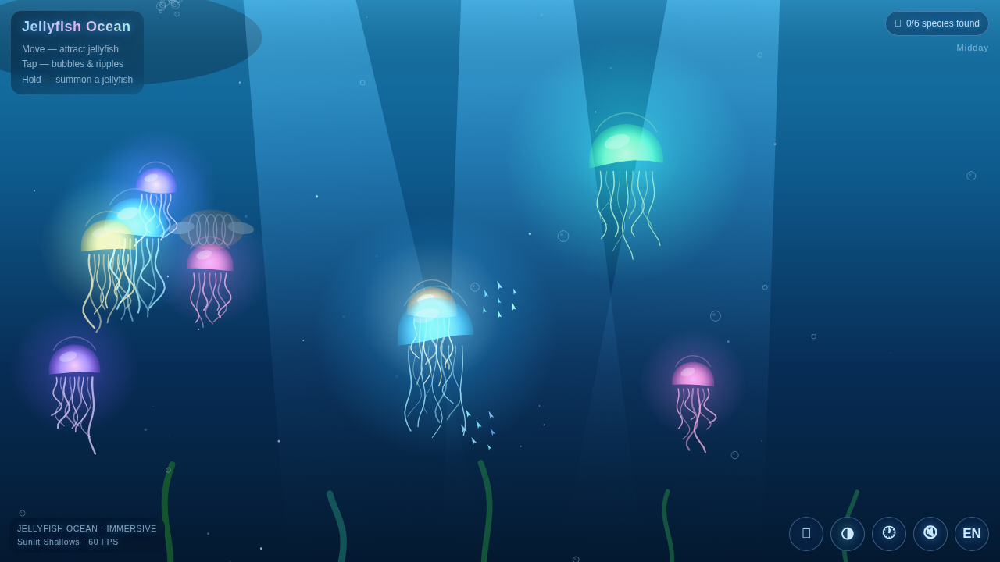

<div align="center">

# 🪼 Jellyfish Ocean

**🌊 一个沉浸式交互水母海洋 · ✨ 零依赖 · 📦 零构建 · 📱 移动优先**

<sub>An immersive, interactive jellyfish ocean — pure vanilla Canvas 2D</sub>

<br />

### 👉 [**🌐 立即在线体验 · Live Demo**](https://elijah-lin-dancer.github.io/Jelly-Fish-childen-game/) 👈

[](https://elijah-lin-dancer.github.io/Jelly-Fish-childen-game/)
[](https://github.com/Elijah-Lin-Dancer/Jelly-Fish-childen-game/blob/main/README.md)
[](https://github.com/Elijah-Lin-Dancer/Jelly-Fish-childen-game)
[](https://github.com/Elijah-Lin-Dancer/Jelly-Fish-childen-game)
[](https://github.com/Elijah-Lin-Dancer/Jelly-Fish-childen-game)
[](https://github.com/Elijah-Lin-Dancer/Jelly-Fish-childen-game)

<br />

<a href="https://elijah-lin-dancer.github.io/Jelly-Fish-childen-game/">
  
</a>

<sub>👆 点击上图直接进入在线体验 · Click the preview to open the live demo</sub>

</div>

---

## 📖 目录 · Table of Contents

- [✨ 项目简介](#-项目简介--about)
- [🎮 核心玩法](#-核心玩法--gameplay)
- [🌊 视觉特性](#-视觉特性--visuals)
- [⚡ 快速开始](#-快速开始--quick-start)
- [🕹️ 操作说明](#️-操作说明--controls)
- [📁 项目结构](#-项目结构--structure)
- [🏗️ 架构设计](#️-架构设计--architecture)
- [📱 移动端适配](#-移动端适配--mobile)
- [🌐 浏览器支持](#-浏览器支持--browser-support)
- [⭐ 支持项目](#-支持项目--show-your-support)
- [📄 许可证](#-许可证--license)

---

## ✨ 项目简介 · About

> 🪼 **Jellyfish Ocean** 是一片可以触摸的深海。六种发光水母在水中漂浮，鱼群结队游弋，
> 阳光斜斜穿过水面，远处有鲸鱼缓缓游过 —— 全部用**纯 Canvas 2D 手写**，没有任何框架和依赖。

整个项目是 **26 个文件、约 2400 行代码** 的单页应用，不经过任何打包工具，直接在浏览器里以原生
**ES Modules** 运行。给它一个静态服务器（或 GitHub Pages），它就能跑。

<div align="right"><a href="#-目录--table-of-contents">⬆️ 回到顶部</a></div>

---

## 🎮 核心玩法 · Gameplay

| 🎯 玩法 | 📝 说明 |
| :--- | :--- |
| 🪼 **物种图鉴** | 点击水母收集 6 个物种，进度保存到 `localStorage`。集齐后解锁隐藏的深海传说 🏆 |
| 🍤 **投喂互动** | 打开投喂模式，点击投放发光鱼饵，鱼群与水母会**汇聚过来抢食** 🌊 |
| 🕐 **昼夜循环** | 60 秒一个完整日夜，天色、光线角度和水母辉光随太阳变化，可随时暂停 ⏸️ |
| 🧬 **成长与变异** | 长按召唤**幼体水母**并随时间长大；连点某只水母 5 次触发**配色变异** 🎨 |

<div align="right"><a href="#-目录--table-of-contents">⬆️ 回到顶部</a></div>

---

## 🌊 视觉特性 · Visuals

### 🪼 生命与生态
- 🎨 **六种水母** —— 半透明发光伞盖 + 14 段动态触手，各有独特配色与形态
- 🐠 **Boids 鱼群** —— 内聚 / 分离 / 对齐三力模型，还会主动躲避你的指针
- 🐢 **海龟** 悠然划过，🐋 **远景鲸鱼** 剪影缓缓现身并吐泡泡
- 🦠 **浮游生物** 与 🌿 **海草** 构成完整的底层生态

### 💡 光影与氛围
- ☀️ **丁达尔光柱** —— 阳光穿透水面的体积光，配合水面辉光与深度雾
- 🔊 **程序化环境音** —— WebAudio 振荡器 + 带通白噪声实时合成，随日照变化
- 🎨 **双主题正交** —— 色调由主题决定，明暗由昼夜决定，两者互不干扰

### 🎭 双主题
- ☀️ **Sunlit Shallows / 阳光浅滩** —— 明亮的青色阳光穿透海水（概念艺术风格）
- 🌙 **Deep Dive / 深海潜行** —— 原始、静谧的幽深氛围

<div align="right"><a href="#-目录--table-of-contents">⬆️ 回到顶部</a></div>

---

## ⚡ 快速开始 · Quick Start

### 🚀 方式一：直接体验（最快）

👉 **[打开在线站点](https://elijah-lin-dancer.github.io/Jelly-Fish-childen-game/)** —— 无需安装任何东西 ✨

### 💻 方式二：本地运行

**零安装、零构建**，任意静态服务器都可以：

```bash
cd ocean
python3 -m http.server 8080
# 然后打开 http://localhost:8080
```

> ⚠️ **注意**：ES Modules 需要 HTTP(S) 协议。直接用 `file://` 打开 `index.html` 会因 CORS 失败 ——
> 请使用本地服务器或 GitHub Pages。

### 🌐 部署到 GitHub Pages

本项目**零配置**即可部署，因为它是纯静态产物：

- 📌 **Source**：`Deploy from a branch` → `main` / `(root)`
- 🔧 **Build type**：`legacy` —— GitHub 内置构建器，**无需任何 workflow 文件**
- 🔄 **自动同步**：每次 `git push origin main` 都会重新构建发布，约 1 分钟后生效
- 📄 `.nojekyll` 已提交，确保 Jekyll 不会忽略 `js/` 等目录

> 🍴 想部署你自己的副本？push 到你的仓库，然后进入
> Settings → Pages → Source 选择 `Deploy from a branch` → `main` / `(root)` → Save，即可。

<div align="right"><a href="#-目录--table-of-contents">⬆️ 回到顶部</a></div>

---

## 🕹️ 操作说明 · Controls

| 🎮 操作 | ✨ 效果 |
| :--- | :--- |
| 🖱️ 移动指针 / 手指 | 🪼 吸引水母跟随 |
| 👆 轻点 | 🫧 气泡 + 涟漪 · 🪼 收集物种 · 🍤 投放鱼饵（投喂模式下） |
| ✊ 长按（500ms） | 🐣 召唤一只幼体水母 |
| 🫧 | 🍤 切换投喂模式 |
| 🌗 | 🎨 切换主题 |
| 🕐 | ⏸️ 暂停 / 继续昼夜循环 |
| 🔊 | 🎵 环境音开关 |
| EN / 中 | 🌐 切换语言（默认英文） |

<div align="right"><a href="#-目录--table-of-contents">⬆️ 回到顶部</a></div>

---

## 📁 项目结构 · Structure

```
🌊 ocean/
├── 📄 index.html
├── 🎨 css/
│   └── main.css              # HUD、响应式、安全区、中英排版
├── ⚙️ js/
│   ├── main.js               # 入口：串联一切，持有各对象
│   ├── 🧩 core/
│   │   ├── config.js         # 常量、数学工具、画质分级
│   │   ├── state.js          # 唯一数据源（view / theme / dayNight…）
│   │   ├── loop.js           # 系统调度器
│   │   ├── resize.js         # 防抖软重建 resize
│   │   └── audio.js          # WebAudio 环境音 + 日照调制
│   ├── 🪼 entities/          # jellyfish, fish, turtle, whale, env …
│   ├── 🌊 systems/           # scenery, dayNight, feeding
│   ├── 🎮 gameplay/          # collection
│   └── 🖥️ ui/                # i18n, locales, hud, interact, perf
└── 🖼️ docs/
```

<div align="right"><a href="#-目录--table-of-contents">⬆️ 回到顶部</a></div>

---

## 🏗️ 架构设计 · Architecture

- 🧩 **系统调度器** —— 每一层注册为 `{ id, order, update?, draw?, entities? }`。
  实体层以「倒序迭代回收」方式处理逐项 `update → draw`；无 `update` 的层（如海草）视为常驻。
- ⏱️ **帧率无关** —— 所有运动按 `dt / 16.667` 缩放，120Hz 屏幕不会跑出双倍速。
  `dt` 被钳制在 33ms 内，以应对切标签页后的时间跳变。
- 🎨 **主题 × 昼夜正交** —— 主题提供色相/饱和度，昼夜只提供亮度，二者不相乘，
  所以夜晚永远不会变成死黑。
- 💾 **渐变缓存** —— 背景与水母辉光按 key 缓存，仅在变化时重建，
  避免每帧调用 `createRadialGradient` 造成性能抖动。

<div align="right"><a href="#-目录--table-of-contents">⬆️ 回到顶部</a></div>

---

## 📱 移动端适配 · Mobile

- 📐 **安全区适配** —— `safe-area-inset` + `visualViewport` 处理刘海屏与浏览器地址栏收起
- 🔄 **防抖软重建** —— 屏幕旋转或尺寸变化时保留场景状态，而非清空重来
- ✊ **长按进度环** —— 视觉反馈明确的 500ms 长按交互
- 👆 **混合输入去重** —— 同时兼容触摸与鼠标，避免重复触发
- 🚫 **iOS 长按菜单抑制** —— 防止长按弹出系统菜单打断交互
- ⚡ **自适应画质** —— FPS 采样低于 45 时自动降级渲染层级（实测移动端 33 → 52 FPS）

<div align="right"><a href="#-目录--table-of-contents">⬆️ 回到顶部</a></div>

---

## 🌐 浏览器支持 · Browser Support

✅ Chrome · ✅ Edge · ✅ Safari · ✅ Firefox

任何支持 **ES Modules** 与 **Canvas 2D** 的浏览器都可以运行。
移动端最佳 resize 表现依赖 `visualViewport`（不支持时优雅降级）。

<div align="right"><a href="#-目录--table-of-contents">⬆️ 回到顶部</a></div>

---

## ⭐ 支持项目 · Show Your Support

如果这片海洋让你感到片刻宁静 —— 🪼

**给个 star ⭐ 就是最好的鼓励！**

[](https://github.com/Elijah-Lin-Dancer/Jelly-Fish-childen-game/stargazers)

也欢迎 [提 Issue](https://github.com/Elijah-Lin-Dancer/Jelly-Fish-childen-game/issues) 反馈想法或问题 💡

<div align="right"><a href="#-目录--table-of-contents">⬆️ 回到顶部</a></div>

---

## 📄 许可证 · License

📜 **MIT** —— 可自由使用、修改、分发。

<div align="center">

<br />

🪼 **祝你在这片海里，找到属于自己的宁静。** 🌊

<sub>Made with ❤️ and zero dependencies.</sub>

</div>
